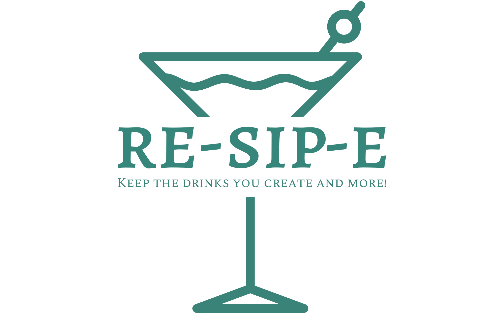

# re•sip•e Backend API

<div align="center">
  <a href="https://github.com/re-sip-e">
    
  </a>
</div>

<center>

      

## [](https://forthebadge.com)

# _*Your bar’s new go-to black book solution. Re-sip-e collects and stores your bar’s drink program for seamless connectivity within your team*_

Organization on GitHub: [re-sip-e](https://github.com/re-sip-e) <br>
Backend Repo: [BE](https://github.com/re-sip-e/re-sip-e_be) <br>
Frontend Repo: [FE](https://github.com/re-sip-e/re-sip-e_fe) <br>
Backend Deployed to: [Fly.io](https://re-sip-e-be.fly.dev/graphiql) <br>
Frontend Deployed to: [Netlify](https://re-sip-e.netlify.app)

---

</center>

## Contributors:

- Backend Team
  - [Thomas Musselman](https://github.com/musselmanth)
  - [Aleisha Mork](https://github.com/aleish-m)
  - [Ryan Smith](https://github.com/RyanChrisSmith)
  - [Riley McCullough](https://github.com/Rileybmcc)
- Frontend Team
  - [Lee Young](https://github.com/Leoy23)
  - [Piper Jarrett](https://github.com/piperjarrett)
  - [Michael Martinelli](https://github.com/mmartinelli22)

## Prerequisites

This project used `Ruby 2.7.4`

- with Rails `5.2.x`
- and used `PostgreSQL`

## Setup/Install

- Fork this repository
- Clone your fork
- From the command line, install gems and set up your DB:
  - `bundle`
- API used
  - https://www.thecocktaildb.com
  - No API key needed
- Run `rails db:{create,migrate,seed}`
- Run the test suite with `bundle exec rspec`.

## There are some different options if you want to test the BE endpoints without using the FE app

- If you would like to test the endpoints in `Postman` or app of your choice:
  - We do have a small seeded DB set up with a bar, a user, and a few drinks with ingredients
  - Run your development server with `rails s` to see the app in action
  - GraphQL Endpoint URL: `http://localhost:3000/graphql` to be used in `Postman`
  - Make sure to put the GraphQL queries/mutations as recommended in the `Body` and with `GraphQL` chosen before hitting `Send`
- You can also test the endpoints in a `GraphiQL` via the BE app being deployed to `Fly.io`
  - Go to `https://re-sip-e-be.fly.dev/graphiql` and you wont have to spin up any servers
  - [linked here](https://re-sip-e-be.fly.dev/graphiql)

## GraphQL Queries/Mutations Table of Contents

- [Get a Bar's Drinks](#get-a-bars-drinks)
- [Get A Single Drink](#get-a-single-drink)
- [Get Single API Drink](#get-single-api-drink)
- [Get API Search Result Drinks](#get-api-search-result-drinks)
- [Get Three Random API Drink](#get-three-random-api-drink)
- [Create a Drink / Save Drink to Database](#create-a-drink--save-drink-to-database)
- [Create Drink w/ Errors](#create-drink-w-errors)
- [Update Existing Drink](#update-existing-drink)
- [Update Existing Drink w/ Errors](#update-drink-w-errors)
- [Delete a Drink](#delete-a-drink)
- [Get Bar Info](#get-bar-info)
- [Get User Info](#get-user-info)

---

## Get a Bar's Drinks

Example Query w/ All Available Fields:

```
query {
  drinks(barId: 1) {
    id
    name
    imgUrl
    steps
    bar {
      id
      name
    }
    ingredients {
      id
      description
    }
  }
}
```

Example Response:

```JSON
{
  "data": {
    "drinks": [
      {
        "id": "1",
        "name": "Negroni",
        "steps": "Stir into glass over ice, garnish and serve.",
        "imgUrl": "https://www.thecocktaildb.com/images/media/drink/qgdu971561574065.jpg",
        "bar": {
          "id": "1",
          "name": "Joe's Bar"
        }
        "ingredients": [
          {
            "id": "5",
            "name": "1 oz Gin"
          },
          {
            "id": "8",
            "name": "1 oz Campari"
          },
          **etc...**
        ]
      },
      **etc...**
    ]
  }
}
```

### [Back to Table of Contents](#graphql-queriesmutations-table-of-contents)

<br/>

## Get A Single Drink

Example Query w/ All Available Fields:

```
query {
  drink(id: 1) {
    id
    name
    imgUrl
    steps
    bar {
      id
      name
    }
    ingredients {
      id
      description
    }
  }
}
```

Example Response:

```JSON
{
  "data": {
    "drink": {
      "id": "1",
      "imgUrl": "https://www.thecocktaildb.com/images/media/drink/qgdu971561574065.jpg",
      "steps": "Stir into glass over ice, garnish and serve.",
      "name": "Negroni",
      "ingredients": [
        {
          "id": "5",
          "description": "1 oz Gin"
        },
        {
          "id": "6",
          "description": "1 oz Campari",
        },
        {
          "id": "7",
          "description": "1 oz Sweet Vermouth"
        }
      ]
    }
  }
}
```

### [Back to Table of Contents](#graphql-queriesmutations-table-of-contents)

<br/>

## Get API Search Result Drinks

Example Query w/ All Available Fields:

```
query {
  apiDrinks(query: "negroni") {
    id
    name
    imgUrl
    steps
    ingredients {
      description
    }
  }
}
```

Example Response:

```JSON
{
  "data": {
    "apiDrinks": [
      {
        "id": "11003",
        "name": "Negroni",
        "steps": "Stir into glass over ice, garnish and serve.",
        "imgUrl": "https://www.thecocktaildb.com/images/media/drink/qgdu971561574065.jpg",
        "ingredients": [
            {
              "description": "1 oz Gin"
            },
            {
              "description": "1 oz Campari"
            },
            **etc...**
        ]
      },
      **etc...**
    ]
  }
}
```

Example of Response if Cocktail DB is Provides 4xx or 5xx response error:

```JSON
{
  "data":{
    "apiDrinks": null},
    "errors": [
      {
        "message": "the server responded with status 5xx",
        "locations": [
          {
            "line": 2,
            "column": 3
          }
        ],
        "path": [ "apiDrinks" ]
      }
    ]
  }
```

### [Back to Table of Contents](#graphql-queriesmutations-table-of-contents)

<br/>

## Get Single API Drink

Example Query w/ All Available Fields:

```
query {
  apiDrink(id: 11003){
    id
    name
    steps
    imgUrl
    ingredients {
      description
    }
  }
}
```

Example Response:

```JSON
{
  "data": {
    "apiDrink": {
      "id": "11003",
      "name": "Negroni",
      "imgUrl": "https://www.thecocktaildb.com/images/media/drink/qgdu971561574065.jpg",
      "steps": "Stir into glass over ice, garnish and serve.",
      "ingredients": [
        {
          "description": "1 oz Gin"
        },
        {
          "description": "1 oz Campari"
        },
        {
          "description": "1 oz Sweet Vermouth"
        }
      ]
    }
  }
}
```

Example of Response if Cocktail DB is Provides 4xx or 5xx response error:

```JSON
{
  "data":{
    "apiDrink": null},
    "errors": [
      {
        "message": "the server responded with status 5xx",
        "locations": [
          {
            "line": 2,
            "column": 3
          }
        ],
        "path": [ "apiDrink" ]
      }
    ]
  }
```

### [Back to Table of Contents](#graphql-queriesmutations-table-of-contents)

<br/>

## Get Three Random API Drink

Example Query

```
query {
  threeRandomApiDrinks {
    id
    name
    imgUrl
  }
}
```

Example Response:

```JSON
{
  "data": {
    "threeRandomApiDrinks": [
      {
        "id": "178345",
        "name": "Hot Toddy",
        "imgUrl": "https://www.thecocktaildb.com/images/media/drink/ggx0lv1613942306.jpg"
      },
      {
        "id": "17180",
        "name": "Aviation",
        "imgUrl": "https://www.thecocktaildb.com/images/media/drink/trbplb1606855233.jpg"
      },
      {
        "id": "12107",
        "name": "Salty Dog",
        "imgUrl": "https://www.thecocktaildb.com/images/media/drink/4vfge01504890216.jpg"
      }
    ]
  }
}
```

Example of Response if Cocktail DB is Provides 4xx or 5xx response error:

```JSON
{
  "data":{
    "threeRandomApiDrinks": null},
    "errors": [
      {
        "message": "the server responded with status 5xx",
        "locations": [
          {
            "line": 2,
            "column": 3
          }
        ],
        "path": [ "threeRandomApiDrinks" ]
      }
    ]
  }
```

### [Back to Table of Contents](#graphql-queriesmutations-table-of-contents)

<br/>

## Create a Drink / Save Drink to Database

Example Mutation with Reponse Returning All Available Fields:

Input JSON Drink Object:

```JavaScript
const newDrink = {
  "name": "Negroni",
  "steps": "Stir into glass over ice, garnish and serve.",
  "imgUrl": "https://www.thecocktaildb.com/images/media/drink/qgdu971561574065.jpg",
  "barId": 1,
  "ingredients": [
    {
      "description": "1 oz Gin"
    },
    {
      "description": "1 oz Campari"
    },
    {
      "description": "1 oz Sweet Vermouth"
    }
  ]
};
```

GraphQL Variables:

```JavaScript
const variables = {
  "input":{
    "drinkInput": newDrink
  }
}
```

GraphQL Mutation:

```
mutation($input: DrinkCreateInput!){
  drinkCreate(input: $input){
    drink{
      id
      name
      steps
      imgUrl
      ingredients{
        id
        description
      }
    }
  }
}
```

Example Response:

```JSON
{
  "data": {
    "drinkCreate": {
      "drink": {
        "id": "3",
        "name": "Negroni",
        "steps": "Stir into glass over ice, garnish and serve.",
        "imgUrl": "https://www.thecocktaildb.com/images/media/drink/qgdu971561574065.jpg",
        "ingredients": [
          {
            "id": "5",
            "description": "1 oz Gin"
          },
          {
            "id": "6",
            "description": "1 oz Campari"
          },
          {
            "id": "7",
            "description": "1 oz Sweet Vermouth"
          }
        ]
      }
    }
  }
}
```

### [Back to Table of Contents](#graphql-queriesmutations-table-of-contents)

<br/>

## Create Drink w/ Errors

If a given drink object or ingredients does not have the required fields, a response with validation errors will be returned. The following example includes all possible validation errors for drink creation:

```JSON
{
  "data": {
    "drinkCreate": null
  },
  "errors": [
    {
      "message": "Error creating drink",
      "locations": [
        {
          "line": 34,
          "column": 3
        }
      ],
      "path": [
        "drinkCreate"
      ],
      "extensions": {
        "name": [
          "can't be blank"
        ],
        "steps": [
          "can't be blank"
        ],
        "bar": [
          "must exist"
        ],
        "ingredients.description": [
          "can't be blank"
        ]
      }
    }
  ]
}
```

### [Back to Table of Contents](#graphql-queriesmutations-table-of-contents)

<br/>

## Update Existing Drink

**Notes:**

- The ID for the drink to be updated should not be passed as part of the drink object. Instead save it as a separate variable and pass it through the base level of the input GQL Variables. See the examples below.
- Ingredients can either be changed, deleted, or added. Ingredient with an ID passed and a `"_destroy": false"` attribute or no `"_destroy"` key will be updated. Ingredients with an ID and a `"_destroy": true` attribute will be deleted. Ingredients with no id or a null value for ID will create a new ingredient for the drink.

Example Input Object:

```JavaScript
const updatedDrinkId = 3

const updatedDrink = {
  "name": "Negroni Sbagliato",
  "steps": "Stir campari and sweet vermouth into glass over ice, top with proesecco, garnish and serve.",
  "imgUrl": "https://www.thecocktaildb.com/images/media/drink/qgdu971561574065.jpg",
  "ingredients": [
    {
      "id": "5",
      "description": "1 oz Gin",
      "_destroy": true
    },
    {
      "id": "6",
      "description": "1.5 oz Campari"
    },
    {
      "id": "7",
      "description": "1.5 oz Sweet Vermouth"
    },
    {
      "id": null,
      "description": "1.5 oz Prosecco"
    }
  ]
}
```

Example GQL Variables Object:

```JavaScript
{
  "input": {
    "id": udpatedDrinkId,
    "drinkInput": updatedDrink
  }
}
```

Example GQL Mutation:

```
mutation($input: DrinkUpdateInput!){
  drinkUpdate(input: $input){
    drink{
      id
      name
      steps
      imgUrl
      ingredients{
        id
        description
      }
    }
  }
}
```

Example Response:

```JSON
{
  "data":{
    "drinkUpdate": {
      "drink":{
        "id": "3",
        "name": "Negroni Sbagliato",
        "steps": "Stir campari and sweet vermouth into glass over ice, top with proesecco, garnish and serve.",
        "imgUrl": "https://www.thecocktaildb.com/images/media/drink/qgdu971561574065.jpg",
        "ingredients": [
          {
            "id": "6",
            "description": "1.5 oz Campari"
          },
          {
            "id": "7",
            "description": "1.5 oz Sweet Vermouth"
          },
          {
            "id": "8",
            "description": "1.5 oz Prosecco"
          }
        ]
      }
    }
  }
}
```

### [Back to Table of Contents](#graphql-queriesmutations-table-of-contents)

<br/>

## Update Drink w/ Errors

If a given drink object or ingredients does not have the required fields on an update, or the drink or ingredient being updated do not exist, a response with validation errors will be returned. The following is an example of an response from an update with invalid validations:

```JSON
{
  "data": {
    "drinkUpdate": null
  },
  "errors": [
    {
      "message": "Error updating drink",
      "locations": [
        {
          "line": 33,
          "column": 3
        }
      ],
      "path": [
        "drinkUpdate"
      ],
      "extensions": {
        "name": [
          "can't be blank"
        ],
        "steps": [
          "can't be blank"
        ],
        "ingredients.description": [
          "can't be blank"
        ]
      }
    }
  ]
}
```

### [Back to Table of Contents](#graphql-queriesmutations-table-of-contents)

<br/>

## Delete a Drink

- Note that at this time there are not possible errors for deleting a drink unless the id provided is not valid.

Example GQL Variables:

```JSON
{
  "input":{
    "id": 1
  }
}
```

Example Mutation:

```
mutation($input: DeleteDrinkInput!){
  deleteDrink(input: $input)
  ){
    success
    errors
  }
}
```

Example Response:

```JSON
{
  "data": {
    "deleteDrink": {
      "errors":[],
      "success":true
    }
  }
}
```

### [Back to Table of Contents](#graphql-queriesmutations-table-of-contents)

<br/>

## Get Bar Info

Example Query w/ Available Fields

```
query {
  bar(id: 1) {
    id
    name
    drinkCount
    drinks {
      id
      name
      imgUrl
    }
  }
}
```

Example Response

```JSON
{
  "data": {
    "bar": {
      "id": "1",
      "name": "Joe's Bar",
      "drinkCount": 5,
      "drinks": {
        "id": "1",
        "name": "Negroni",
        "imgUrl": "https://www.thecocktaildb.com/images/media/drink/qgdu971561574065.jpg"
      },
      **etc...**
    }
  }
}
```

### [Back to Table of Contents](#graphql-queriesmutations-table-of-contents)

<br/>

## Get User Info

Example Query w/ Available Fields

```
query {
  user(id: 1) {
    id
    name
    barCount
    bars{
      id
      name
      drinkCount
    }
  }
}
```

Example Response:

```JSON
"data": {
  "user": {
    "id": "1",
    "name": "Joe Schmoe",
    "barCount": 1,
    "bars":[
      {
        "id": "1",
        "name": "Joe's Bar",
        "drinkCount": 5
      }
    ]
  }
}
```

### [Back to Table of Contents](#graphql-queriesmutations-table-of-contents)
